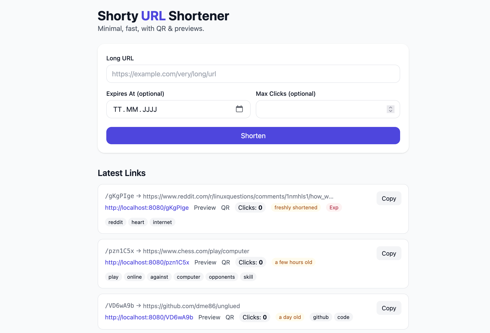

# go shorty

<p align="center">
  
</p>

A fast, production-ready URL shortener written in Go.

**Highlights**
- PostgreSQL storage with migrations (via `goose`)
- Bot-aware **Preview** pages (Slack/Twitter/Discord/etc.) with Open Graph meta
- **QR codes** (PNG) for every link
- **Tags**: inferred from host/path/query and OG metadata
- **Deduplication**: same long URL → reuse existing active short link
- **Max Clicks** & **Expires At** (date-only in UI); **Exp** badge with tooltip
- **Age** badge (“freshly shortened”, “a few days old”, …)
- **/metrics** for Prometheus, **/healthz** for health checks

## Capacity (Shortcodes)

Default code length: **7 Base62 characters** (`a-zA-Z0-9`).  
Theoretical space: `62^7 = 3,521,614,606,208` unique short links (~3.52 trillion).

> Collisions are extremely unlikely; in addition the database enforces uniqueness.

---

## Quickstart

Requirements
- Go ≥ 1.21
- Docker (for local Postgres)
- `goose` (optional; the Makefile can install it)

```bash
# 1) Start Postgres via Docker and wait until ready
make db-up

# 2) Install goose (if not yet installed)
make goose-install

# 3) Apply database migrations
make migrate-up

# 4) Run the app
make run

# Open the UI
open http://localhost:8080
```

**Endpoints**

-   UI: `GET /`
-   Resolve: `GET /{code}` → 302 redirect to long URL (unless a bot)
-   Preview page: `GET /preview/{code}`
-   QR: `GET /api/links/{code}/qr.png`
-   Health: `GET /healthz`
-   Prometheus metrics: `GET /metrics`

## Configuration

Environment variables:

-   `BASE_URL` – public base URL, e.g. `http://localhost:8080` or `https://sho.rt`
-   `DATABASE_URL` – Postgres DSN used by the server
-   `DB_URL` – Postgres DSN used by `make`/`goose`

## API Overview

### Create a short link

```bash
POST /api/links
Content-Type: application/json

{
  "url": "https://example.com/path?q=abc",
  "expires_at": "2025-12-31T22:59:59Z",  // optional; UI sends end-of-day ISO
  "max_clicks": 100                      // optional
}
```

Response:

```json
{
  "code": "Ab12Cde",
  "short_url": "http://localhost:8080/Ab12Cde",
  "preview_url": "http://localhost:8080/preview/Ab12Cde",
  "qr_url": "http://localhost:8080/api/links/Ab12Cde/qr.png"
}
```

**Deduplication:** If an **active** short link for the exact same long URL exists (not expired, not maxed), it is returned instead of creating a new code.

### List links

```bash
GET /api/links
GET /api/links?tag=steam
```

Returns latest **active** links with `tags`, `created_at`, `click_count`, `expires_at`.

### Resolve

```bash
GET /{code}   → 302 redirect to the long URL
```

User agents that look like bots (Slack/Twitter/Discord/…) get the Preview page to allow rich unfurls; real browsers are redirected. Click counting is **atomic** and respects `expires_at`/`max_clicks`.

### QR

```bash
GET /api/links/{code}/qr.png
```

Returns a 256px PNG (the UI shows an inline modal with download).

## Observability

-   **/healthz** → `200 ok` if DB is reachable (500ms timeout), otherwise `500 db=down`
-   **/metrics** (Prometheus):
    -   `shorty_links_created_total` (counter)
    -   `shorty_resolve_redirects_total` (counter)
    -   `shorty_links_total` (gauge; `COUNT(*)`)
    -   `shorty_links_active` (gauge; active = not expired & not maxed)
    -   `shorty_tags_distinct_total` (gauge; `COUNT(DISTINCT UNNEST(tags))`)
    -   `shorty_clicks_sum` (gauge; `SUM(click_count)`)
    -   `shorty_metrics_collect_errors_total` (counter; DB errors during metric collection)
        

Prometheus scrape example:

```yaml
scrape_configs:
  - job_name: shorty
    static_configs:
      - targets: ['localhost:8080']
```

## Security & Scope

-   No authentication / multi-tenant isolation (kept intentionally minimal)
-   No rate limiting or abuse protection
-   Custom aliases disabled by design
-   Tag inference is heuristic and can be extended per domain
-   Deduplication is by **exact URL** (query differences → distinct targets)

## Screenshot

<p align="center">
  
</p>

